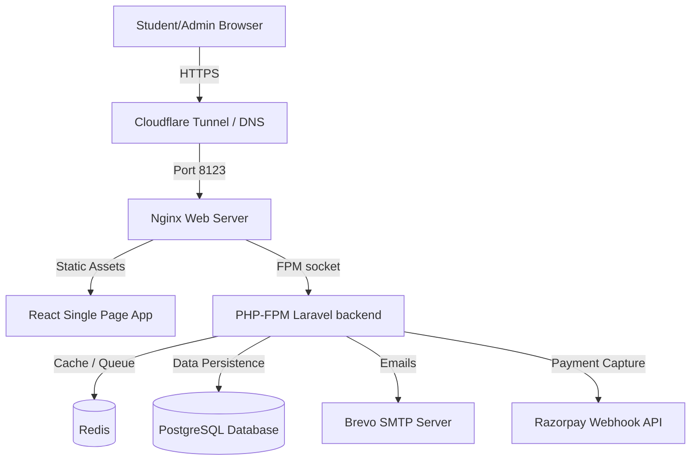

# VIC Farewell & Event Ticketing Portal — Deployment Guide

This guide provides step-by-step instructions on how to configure, build, run, and deploy the custom **VIC Farewell & Event Ticketing Portal** (built on a hardened fork of Hi.Events with Laravel, React, TypeScript, PostgreSQL, and Redis).

---

## 1. System Architecture Overview

The system consists of the following components working in unison:



*   **Frontend:** React (TypeScript) SPA built with Vite. Consumes the backend REST API.
*   **Backend:** Laravel (PHP 8.3) REST API managing business logic, student lookup rules, transactions, and event configurations.
*   **Worker & Scheduler:** Laravel Queue Worker & Scheduler managed by Supervisor inside the container to handle email dispatch and background tasks.
*   **Database:** PostgreSQL 17 for relational storage (student rosters, pricing rules, orders, check-ins).
*   **Cache & Queue:** Redis 7 for queue management and session cache.

---

## 2. Prerequisites

Ensure your host system (local server, virtual machine, or local PC) has the following installed:
*   **Docker Desktop** or **Docker Engine** (version 24.0.0+)
*   **Docker Compose** (version 2.20.0+)
*   **Git** for version control
*   **Cloudflare CLI (`cloudflared`)** — if you plan to expose the application to the public internet without open ports.

---

## 3. Production Deployment (All-in-One Docker — Recommended)

This mode packs the compiled React frontend, Nginx, PHP-FPM, and Supervisor into a single container (`all-in-one`), which connects to companion PostgreSQL and Redis containers.

### Step 1: Navigate to the Docker Folder
```bash
cd Hi.Events/docker/all-in-one
```

### Step 2: Configure Environment Variables
Copy `.env.example` to `.env`:
```bash
cp .env.example .env
```
Open `.env` in a text editor and fill out the values. Below is a comprehensive reference of what must be set.

#### Essential Environment Settings
*   `APP_KEY`: Generate a 32-character base64 key using `openssl rand -base64 32` or via Laravel helper:
    ```bash
    # Run locally if php is installed:
    php artisan key:generate --show
    ```
*   `JWT_SECRET`: A secure random string for JWT auth token generation.
*   `APP_URL`: The public URL of your application (e.g., `https://vic.codepode.in`).
*   `APP_FRONTEND_URL`: Set to the same as `APP_URL` in production (e.g., `https://vic.codepode.in`).

#### PostgreSQL Settings
*   `POSTGRES_DB`: Name of the database (e.g., `vic_events`)
*   `POSTGRES_USER`: Database username (e.g., `vic_admin`)
*   `POSTGRES_PASSWORD`: Secure database password (do not leave empty or as default)

#### Razorpay API Keys (Switch to Live keys for production)
*   `RAZORPAY_KEY_ID`: Your Razorpay client key (starts with `rzp_live_` or `rzp_test_`)
*   `RAZORPAY_KEY_SECRET`: Your Razorpay secret key
*   `RAZORPAY_WEBHOOK_SECRET`: Secure string used to verify incoming Webhook signatures (configure this in Razorpay dashboard first, then match it here).

#### SMTP Brevo Mail Settings (For Ticket Emails)
*   `MAIL_MAILER`: `smtp`
*   `MAIL_HOST`: `smtp.brevo.com`
*   `MAIL_PORT`: `587`
*   `MAIL_USERNAME`: Your Brevo account email or login
*   `MAIL_PASSWORD`: Your Brevo SMTP API key (master or subaccount key)
*   `MAIL_FROM_ADDRESS`: `events@vic.college` (or your verified domain email)
*   `MAIL_FROM_NAME`: `"VIC Events"`

---

### Step 3: Build and Run Services
Run Docker Compose to build the custom all-in-one image and launch all containers in detached mode:
```bash
docker compose up --build -d
```
This command will:
1.  Spin up node container to compile the React frontend.
2.  Build the custom PHP-FPM / Nginx image from [Dockerfile.all-in-one](file:///Volumes/DATA/VIC/Hi.Events/Dockerfile.all-in-one).
3.  Start PostgreSQL, Redis, and the All-in-One server.
4.  Bind the web server to host port `8123` (mappable in `docker-compose.yml`).

---

### Step 4: Run Initial Database Migrations
On startup, the [startup.sh](file:///Volumes/DATA/VIC/Hi.Events/docker/all-in-one/scripts/startup.sh) script automatically attempts to run migrations. However, to execute them manually or verify status, run:
```bash
# Force run migrations in case they did not execute
docker compose exec all-in-one php artisan migrate --force

# Check status to make sure all 7 custom tables/columns are added
docker compose exec all-in-one php artisan migrate:status
```

---

## 4. Local Development Deployment

If you want to run the project in development mode with separate containers and hot-reloads:

1.  Navigate to the development docker folder:
    ```bash
    cd Hi.Events/docker/development
    ```
2.  Configure `.env` files in `backend` and `frontend` folders by copying the `.env.example` files.
3.  Run the startup shell helper script:
    ```bash
    ./start-dev.sh
    ```
    *   This will check/install SSL certificates (using `mkcert` or unsigned keys) for local HTTPS.
    *   Launches separate frontend (port 5173), backend (port 8000), PostgreSQL, Redis, and Nginx (HTTPS port 8443).
    *   Composer installations and migrations are run automatically.
4.  Open `https://localhost:8443/auth/register` to register your administrator account.

---

## 5. Exposing the App with Cloudflare Tunnel (`cloudflared`)

To route external public traffic to the local Docker setup securely (without exposing ports on a router or configuring public IPs):

### Step 1: Install Cloudflare Tunnel Client
On macOS:
```bash
brew install cloudflare/cloudflare/cloudflared
```
On Linux (Debian/Ubuntu):
```bash
curl -L --output cloudflared.deb https://github.com/cloudflare/cloudflared/releases/latest/download/cloudflared-linux-amd64.deb
sudo dpkg -i cloudflared.deb
```

### Step 2: Login and Authorize
```bash
cloudflared tunnel login
```
This opens a browser window. Select the Cloudflare account and domain you want to use (e.g., `codepode.in`).

### Step 3: Create the Tunnel
```bash
cloudflared tunnel create vic-farewell
```
This generates a Tunnel UUID and saves credentials to `~/.cloudflared/<tunnel-uuid>.json`.

### Step 4: Configure the Ingress Rules
Create a configuration file at `~/.cloudflared/config.yml` (or `~/.cloudflared/vic-farewell.yml`):
```yaml
tunnel: vic-farewell
credentials-file: /Users/<your_username>/.cloudflared/<tunnel-uuid>.json

ingress:
  - hostname: vic.codepode.in
    service: http://localhost:8123
  - service: http_status:404
```

### Step 5: Setup Route DNS
Add the CNAME record mapping your hostname to the tunnel endpoint:
```bash
cloudflared tunnel route dns vic-farewell vic.codepode.in
```

### Step 6: Run the Tunnel in Background
To keep the tunnel running persistently as a system daemon (so it survives restarts/reconnects):
```bash
sudo cloudflared service install
# Or run manually in screen/background:
nohup cloudflared tunnel run vic-farewell > ~/cloudflared.log 2>&1 &
```

---

## 6. Razorpay Webhook Configuration

To receive confirmation after a student completes their payment:

1.  Log in to the [Razorpay Dashboard](https://dashboard.razorpay.com).
2.  Go to **Account & Settings** → **Webhooks**.
3.  Click **Add New Webhook** and fill out the details:
    *   **Webhook URL:** `https://vic.codepode.in/api/webhooks/razorpay`
    *   **Secret:** Generate a strong random string (e.g., `openssl rand -hex 32`) and save it to the container's `.env` as `RAZORPAY_WEBHOOK_SECRET`.
    *   **Active Events:** Select `payment.captured` **only**.
4.  Go to **Account & Settings** → **Business Website Details** → **Add Additional Website** and register `vic.codepode.in`.

---

## 7. First-Time Setup & Operational Checklist

Once the app is running and the DNS routes traffic successfully, configure the database:

### 1. Register Admin Account
Go to `https://vic.codepode.in/auth/register` (or `https://vic.codepode.in/admin`) and create the primary administrator credentials.

### 2. Prepare the Student Roster Excel Sheet
Create an Excel spreadsheet (`.xlsx` or `.csv`) with the following column headers (case-sensitive):
*   `enrollment_no` (e.g., `22045` or batch prefixed keys)
*   `name`
*   `email`
*   `phone` (Optional)

### 3. Upload Roster
In the Admin Dashboard:
1.  Navigate to **Student Roster** → **Import Roster**.
2.  Upload the `.xlsx`/`.csv` sheet. This runs an upsert operation (safe to run multiple times, updates email/names if enrollment number matches).

### 4. Create Pricing Rules
Navigate to **Pricing Rules** and add rules based on student enrollment identifiers:
*   **Rule 1 (Seniors):** Prefix pattern `22` (Batch of 2022) → Set price to `0` (Complimentary ticket).
*   **Rule 2 (Juniors):** Prefix patterns `19`, `20`, `21` → Set price to `200` (Razorpay checkout triggered).

### 5. Set Ticket Scan Limits
Under **Event Settings**, configure:
*   `max_scans_per_ticket`: `2` (allows entry scan and food scan) or `3`.
*   `scan_slot_labels`: `["Entry Gate", "Food Counter", "Dessert Counter"]`

---

## 8. Maintenance & Troubleshooting Commands

### Clear and Re-cache App Config
If you edit settings in `.env`, you must re-cache Laravel:
```bash
docker compose exec all-in-one php artisan config:cache
docker compose exec all-in-one php artisan route:cache
```

### View Application Logs
Check container console logs:
```bash
docker compose logs all-in-one -f
```
Check Laravel log files:
```bash
docker compose exec all-in-one tail -f /app/backend/storage/logs/laravel.log
```

### Check Database Connection
```bash
docker compose exec postgres pg_isready -U postgres
```
